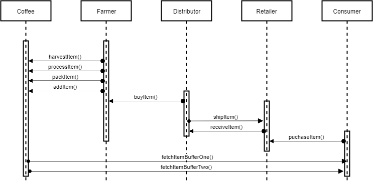

# Supply Chain Project

## Truffle Version
>
    Truffle v5.1.13
>

## Node Version
>
    node v12.13.0
>

## web3 Version
>
    web3@1.0.0-beta.37
>
## Contract Address
>
    0xfe70e83E19BBE5eCe2a367117eE46f2B6616453d 
>

## Requirement 1: Project write-up - UML

### Activity Diagram


### Sequence Diagram


### State Diagram


### Class Diagram (Data Model)


## Requirement 2: Project write-up - Libraries
Roles which is a library was used to manage access control in DAPP. It was used to add and remove roles in the access control contracts ```FarmerRole.sol, DistributorRole.sol, RetailerRole.sol, and ConsumerRole.sol```. ```truffle-assertions`` was also used for emitted events comparism in the test file

## Requirement 3: Project write-up - IPFS
IPFS was not used in the project at all

## Getting Started

These instructions will get you a copy of the project up and running on your local machine for development and testing purposes. See deployment for notes on how to deploy the project on a live system.

### Prerequisites

Please make sure you've already installed ganache-cli, Truffle and enabled MetaMask extension in your browser.
```
npm install -g ganache-cli
```

### Installing

A step by step series of examples that tell you have to get a development env running

Clone this repository:

```
git clone https://github.com/akinlekan28/supplychain
```

Change directory to ```project-6``` folder and install all requisite npm packages (as listed in ```package.json```):

```
cd project-6
npm install
```

Launch Ganache:

```
ganache-cli -m "spirit supply whale amount human item harsh scare congress discover talent hamster"
```

In a separate terminal window, Compile smart contracts:

```
truffle compile
```

This will create the smart contract artifacts in folder ```build\contracts```.

Migrate smart contracts to the locally running blockchain, ganache-cli:

```
truffle migrate
```

Test smart contracts:

```
truffle test
```

All 10 tests should pass.

In a separate terminal window, launch the DApp:

```
npm run dev
```